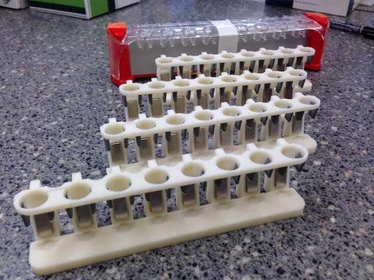

With the help of Ken Meacham of the [Bandi Unit][1], we have successfully used some magnets to inexpensively 3D print our own magnetic stands based on [this design][2] and some inexpensive [magnets][3]. They look like cheap imitations, but just as well, if not better, and cost orders of magnitude less (last I checked the commercial stand in the background would set you back a cool [US$531][4]).

<figure>
		 
</figure>

 [1]: https://groups.oist.jp/ciu/mahesh-m-bandi
 [2]: http://www.thingiverse.com/thing:79424
 [3]: http://www.kjmagnetics.com/proddetail.asp?prod=B824
 [4]: http://www.lifetechnologies.com/order/catalog/product/12321D
