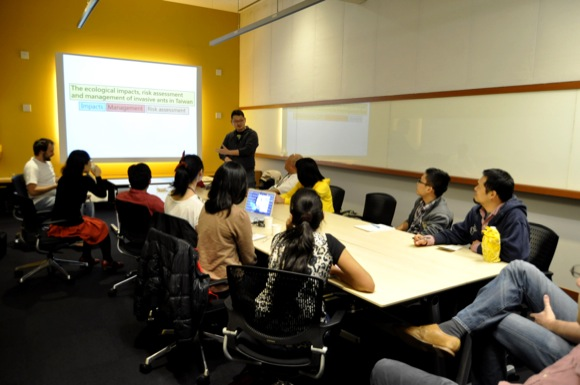

<figure>
	
	<figcaption>NTU Group Visit</figcaption>
</figure>
 
We were the proud hosts of Dr. Scotty Yang&#8217;s research group and his colleagues from Taiwan National University. His research group specializes in studying the patterns of  dispersal in a variety of invasive ant species. We were treated to a wide range of topics, including a few fascinating finding about Wolbachia distributions in invasive ants.

**Taiwan talks** 

  * Global invasion history and Wolbachia infection patterns of crazy ant *Paratrechina longicornis* I (Dr. Chin-Cheng Yang)
  * Global invasion history and Wolbachia infection patterns of crazy ant *Paratrechina longicornis* II (Ms. Shu-Ping Tseng)
  * Global invasion history and Wolbachia infection patterns of yellow crazy ant *Anoplolepis gracilipes* (Ms. Ho Han-Chih)
  * Chemical ecology and seed collecting behaviors of invasive fire ants in Taiwan (Dr. Li-Chuan Lai)

**OIST talks** 

  * Sex determination in *Vollenhovia emeryi* (Dr. Misato Okamoto)
  * Molecular signatures of ancient mutualistic coevolution in attine ants and their fungal cultivars (Dr. Alexander Mikheyev)
