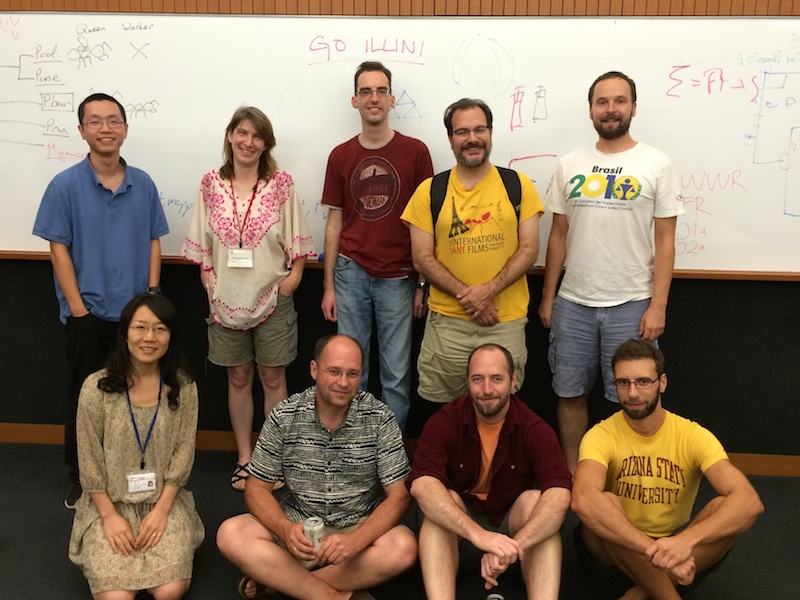

We were happy to host our excellent US and European-based collaborators to jointly work on the evolution of social parasite genomes. In the few days of the workshop we made major progress, finally bringing the project over the hill and hopefully en route to eventual publication.
 
<figure>
	
	<figcaption>Participants (as ordered in photo): Ti Eriksson (Arizona State University), Sara Helms Cahan (University of Vermont), Karsten Kemena (Muenster University), Andy Suarez (University of Illinois), Sasha Mikheyev (OIST) Misato Miyakawa (OIST), Juergen Gadau (ASU), Chris Smith (Earlham College), Martin Helmkampf (ASU). </figcaption>
</figure>
 
 

