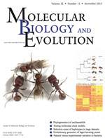

# Publications

* M.O. Miyakawa and A.S. Mikheyev, QTL mapping of sex determination loci supports an ancient pathway in ants and honey bees. PLoS Genetics, *in press*

* G. Fischer, F.L. Azorsa, F.H. Garcia, A.S. Mikheyev, E.P. Economo. Two new phragmotic ant species from Africa: morphology and next-generation sequencing solve a caste association problem in the genus *Carebara* Westwood. ZooKeys 525: 77-105, 2015

* 

C.R. Smith S. Helms Cahan, C. Kemena, S.G. Brady, W. Yang, E. Bronberg-Bauer, T. Eriksson, J. Gadau, M. Helmkampf, D. Gotzek, M. O. Miyakawa, A.V. Suarez and A.S. Mikheyev, How do genomes create novel phenotypes? Insights from the loss of the worker caste in ant social parasites, Molecular Biology and Evolution, 32: 2919-2931, 2015 

* A.S. Mikheyev, M.M.Y. Tin, J. Arora and T.D. Seeley, Museum samples reveal rapid evolution by wild honey bees exposed to a novel parasite, Nature Communications, 6: 7991, 2015 

* S.D. Aird, S. Aggarwal, A. Villar-Briones, M.M.Y. Tin, K. Terada, and A.S. Mikheyev, Snake venoms are integrated systems, but abundant venom proteins evolve more rapidly. BMC Genomics, 16:647, 2015 

* C. Parmesan, A. Williams-Anderson, M. Moskwik, A.S. Mikheyev and M.C. Singer. Endangered Quino checkerspot butterfly: A climate change success story? Journal of Insect Conservation. 19:185-204, 2015. 

* M.M.Y. Tin, F.E. Rheindt, E. Cros and A.S. Mikheyev, Degenerate adaptor sequences for detecting PCR duplicates in reduced representation sequencing data improve genotype calling accuracy. Molecular Ecology Resources. 15:2 329-336, 2015. 

* M.O. Miyakawa and A.S. Mikheyev. Males are here to stay: fertilization enhances viable egg production by clonal queens of the little fire ant (*Wasmannia auropunctata*). The Science of Nature. 102:15, 2015. .pdf)

* A.S. Mikheyev and T. Linksvayer. Genes associated with ant social behavior show distinct transcriptional and evolutionary patterns. eLife 2015;10.7554/eLife.04775, 2015. 

* A.S. Mikheyev and M.M.Y. Tin. A first look at the Oxford Nanopore MinION sequencer. Molecular Ecology Resources. 14: 1097–1102. 2014 

* O. Gusev *et al.* Comparative genome sequencing reveals genomic signature of extreme desiccation tolerance in the anhydrobiotic midge. Nature Communications. 5:4784. 2014 

* Tin M.M.-Y., Economo E.P., and  A.S. Mikheyev. Sequencing degraded DNA from non-destructively sampled museum specimens for RAD-tagging and low-coverage shotgun phylogenetics. PLoS ONE 9(5):e96793, 2014. 
    - [GenomeWeb write-up](http://www.genomeweb.com/sequencing/researchers-develop-method-sequencing-degraded-dna)

* S.D. Aird, Y. Watanabe, A. Villar-Briones, M.C. Roy, K. Terada, and A.S. Mikheyev. Quantitative high-throughput profiling of snake venom gland transcriptomes and proteomes (*Ovophis okinavensis* and *Protobothrops avoviridis*). BMC Genomics, 14:790, 2013.  .pdf)

* A.S. Mikheyev, C.S. McBride, U.G. Mueller, C. Parmesan, M.R. Smee, C. Stefanescu, B. Wee, and M.C. Singer. Host-associated genomic dierentiation in congeneric butterflies: now you see it, now you do not. Molecular Ecology, 22:4753-4766, 2013. 

* M.R. Smee, Y. Pauchet, P. Wilkinson, B. Wee, M.C. Singer, D.J. Hodgson, and A.S. Mikheyev. Microsatellites for the marsh fritillary butterfly: *De novo* transcriptome sequencing, and a comparison with amplified fragment length polymorphism (AFLP) markers. PloS ONE, 8(1):e54721, 2013. %20Markers.pdf)

* U.G. Mueller, A.S. Mikheyev *et al*. Evolution of cold-tolerant fungal symbionts permits winter fungiculture by leafcutter ants at the northern frontier of a tropical ant-fungus symbiosis. Proceedings of the National Academy of Sciences, 108(10):4053-4056, 2011. 

* U.G. Mueller, A.S. Mikheyev, S.E. Solomon, and M. Cooper. Frontier mutualism: coevolutionary patterns at the northern range limit of the leaf-cutter ant-fungus symbiosis. Proceedings of the Royal Society B: Biological Sciences, 278(1721):3050-3059, 2011. 

* A.E. Dunham and A.S. Mikheyev. Influence of an invasive ant on grazing and detrital communities and nutrient fluxes in a tropical forest. Diversity and Distributions, 16(1):33-42, 2010. 

* J. Foucaud, J. Orivel, A. Loiseau, J.H. Delabie, H. Jourdan, D. Konghouleux, M. Vonshak, M. Tindo, J.L. Mercier, D. Fresneau, and J.-B. Mikissa, T. McGlynn, A.S. Mikheyev, J. Oettler and A. Estoup. Worldwide invasion by the little fire ant: routes of introduction and eco-evolutionary pathways. Evolutionary Applications, 3(4):363-374, 2010. 

* A.S. Mikheyev, U.G. Mueller, and P. Abbot. Comparative dating of attine ant and lepiotaceous cultivar phylogenies reveals coevolutionary synchrony and discord. The American Naturalist, 175(6):E126-E133, 2010. 

* A.S. Mikheyev, T. Vo, B. Wee, M.C. Singer, and C. Parmesan. Rapid microsatellite isolation from a butterfly by *de novo* transcriptome sequencing: performance and a comparison with a AFLP-derived distances. PLoS ONE, 5(6):e11212, 2010. 
