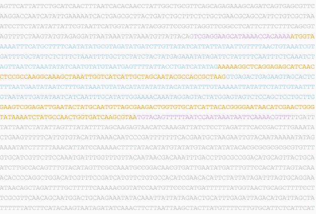



This tutorial is designed to teach students with a limited background in bioinformatics the basics of gene annotation. It allows you, the student, to participate in an ongoing genome project, an effort to decode the entirety of an organism&#8217;s genetic information. Using real data from several ant species, you will learn many skills necessary to explore how genes are working and how they are related to the biology of an organism. You will also be able to develop your own research project studying the function and evolution of a gene or group of genes.

#### What is gene annotation?

At an ever accelerating pace, researchers are generating enourmous amounts of genetic sequence data in order to better understand the development, functioning and evolutionary history of organisms. However, raw sequence data is mostly useless unless it is complemented by additional information about the location, structure and function of the genes it contains. The process of adding this information is called gene annotation. Gene annotation can be performed automatically by software, but typically requires editing by human experts to achieve the highest level of quality. Only accurate gene annotations are useful in studying how an organism&#8217;s genes reflect its biology and evolution.

&nbsp; 

<figure>
		 
</figure>

The example above represents a small section of the genome of the Red harvester ant *Pogonomyrmex barbatus*. Nested within is a gene coding for a Cytoplasmic Ribosomal Protein, with several of its structural features highlighted. Without knowing its structure, the sequence of a gene is meaningless, and very little biological information could be gleaned from it.

&nbsp;

#### Orientation and table of contents

The tutorial is split into four parts, two of mostly theoretical and two of mostly practical nature. To start, please study the first part of the tutorial introducing basic concepts of genetics, genome sequencing, gene annotation and our study organisms, ants. The second part teaches basic technical skills required for gene annotation. Part three is were the hands-on experience begins. You will start by annotating a training set of genes, and then move on to pick your own focal group of genes. Once you have successfully annotated a group of genes, it is time to develop your own research project. Part four will provide you with the skills to study the evolutionary history and functional role of your genes of interest.

&nbsp;

1   Introduction

1.1   [Introduction to genetics][1]

1.2   [Genome sequencing][2]

1.3   [The basics of gene annotation][3]

1.4   [Ants][4]

&nbsp;

2   Basic techniques

2.1   [Browsing genomes][5]

2.2   [BLAST][6]

2.3   [Aligning sequences][7]

2.4   [WebApollo][8]

2.5   [File formats][9]

&nbsp;

3   Hands-on phase

3.1   Training phase: [Getting started][10]

3.2   Project phase: [Focal genes][11]

&nbsp;

4   Beyond annotation: evolutionary analysis

4.1   [Homology assessment][12]

4.2   Phylogenetic analysis

4.3   Signatures of selection

4.4   Functional annotation

&nbsp;

Next chapter: [Introduction to genetics][1]

&nbsp;

 [1]: ../11.introduction-to-genetics
 [2]: ../12.genome-sequencing
 [3]: ../13.gene-annotation
 [4]: ../14.ants
 [5]: ../21.gbrowse
 [6]: ../22.blast
 [7]: ../23.align_sequences
 [8]: ../24.webapollo
 [9]: ../25.file-formats
 [10]: ../31.getting-started
 [11]: ../32.focal-genes
 [12]: ../41.homology-assessment
