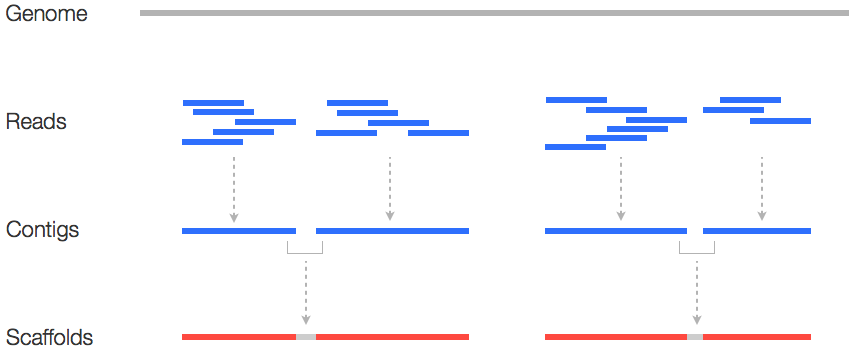
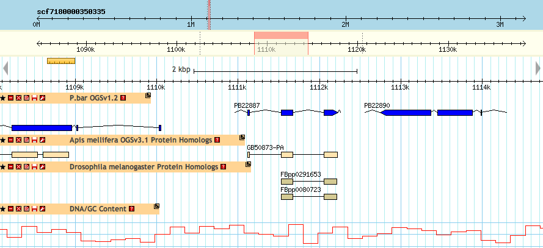



Genome sequencing is the automated process of determining the DNA sequence of an organism&#8217;s entire genome. The first genome projects that focused on more complex organism like the [Human Genome Project][1] took years to complete, involved dozens of participating labs and cost billions of dollars. However, genome sequencing technology progresses rapidly, and nowadays genomes are routinely deciphered by individual labs in a matter of days.

The current generation of sequencing machines, known as next-generation or high-throughput sequencing platforms, produce thousands or millions of sequences simultaneously. The most widely used systems include [Illumina HiSeq][2], [Roche 454][3], ABI SOLiD and [IonTorrent][4], which all operate on different chemical or physical principles.

Thousands of bacterial genomes, and more than a hundred genomes of animals, plants and fungi have been sequenced so far. Genome sizes vary by several order of magnitude, from the smallest bacterial genomes of about 500.000 bases to the largest vertebrate and plant genomes exceeding tens of billions of bases. The sheer amount of data generated requires significant computational resources in terms of data analysis, storage and access. Many genome projects organize their efforts around publicly accessible databases, for instance [FlyBase][5], [WormBase][6] or [Hymenoptera Genome Database][7] (the latter, home to several bee, wasp and ant genomes, will serve as a future example on how these sites are often structured). In addition, most genome data is also available through public databases like [NCBI GenBank][8], a comprehensive collection of diverse molecular data from many organisms.

&nbsp;

#### Genome assembly 

Genome sequencing produces an abundance of short, unordered and partially overlapping **reads**. In order to obtain contiguous, non-redundant sequence from this chaos, the reads have to be aligned to each other and merged wherever two or more reads overlap. This computationally intensive process is called genome assembly. The merging of overlapping reads first creates **contigs**, which are subsequently put in order and combined into **scaffolds** using additional information about the distance between contigs. Ideally, each scaffold represents a single chromosome, but genome assembly is often confounded by highly repetitive genomic regions which may prove impossible to assemble or even to sequence. In practice, genomes are thus typically split into hundreds or thousands of scaffolds ranging in length from a few thousand to several million bases. Regions between scaffolds may remain unresolved, scaffolds themselves may contain gaps, and the relative position of scaffolds to each other is rarely known. Genome assemblies are therefore provisional and considered draft genomes.

&nbsp;

&nbsp;

&nbsp;

#### Transcriptome sequencing 

Sequencing is not restricted to genomes. The set of all RNA molecules (transcripts) present in a sample at a given time, defined as the **transcriptome**, can also be sequenced. Such data is often invaluable for gene annotation efforts, because it provides experimental evidence for the existence and structure of genes that can otherwise only be inferred (for instance, since transcripts do not contain introns, the boundaries between exons and introns can be exactly determined by comparison with the genome sequence). The most common forms of transcript data stem from **RNA-Seq** (RNA sequencing) and **EST** (Expressed Sequence Tag) projects.

&nbsp;

#### Navigating genomes

Genome assemblies can be visualized using a **genome browser**. These applications allow users to navigate assemblies using scaffold identifiers and coordinates, and display annotated features of genomic regions like gene models, experimental evidence for transcribed sequences, or repetitive or unresolved sequence. We will talk about how to use a genome browser in more detail [here][9].

&nbsp;

&nbsp;

Further information: [DNA sequencing][10] on Wikipedia, with a [comparison of next-generation methods][11].

&nbsp;

Next chapter: [The basics of gene annotation][12]

&nbsp;

 [1]: http://en.wikipedia.org/wiki/Human_Genome_Project
 [2]: http://www.illumina.com/technology/sequencing_technology.ilmn
 [3]: http://www.454.com
 [4]: http://www.invitrogen.com/site/us/en/home/brands/Ion-Torrent.html?cid=fl-iontorrent#
 [5]: http://flybase.org
 [6]: http://www.wormbase.org/#01-23-6
 [7]: http://hymenopteragenome.org
 [8]: http://www.ncbi.nlm.nih.gov/genome
 [9]: ../21.gbrowse
 [10]: http://en.wikipedia.org/wiki/DNA_sequencing
 [11]: http://en.wikipedia.org/wiki/DNA_sequencing#Next-generation_methods
 [12]: ../13.gene-annotation
