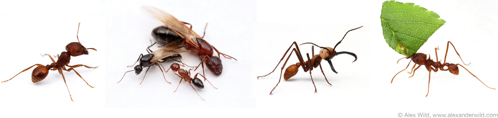
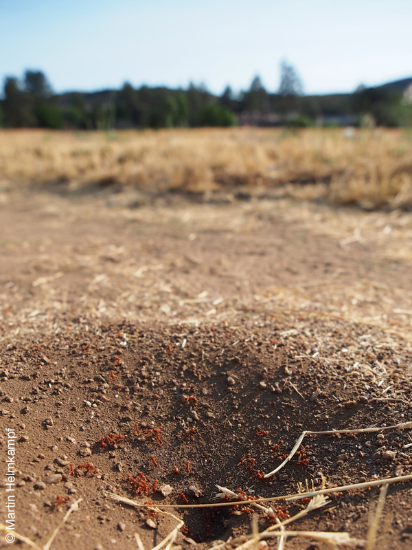



In this tutorial, we will learn how to annotate genes using several recently sequenced ant genomes as an example. Ants are ideal systems to study the genes underlying some very complex traits, including social organization, division of labor and chemical communication. To explain why that is, this section briefly reviews the general biology of ants:

&nbsp;

#### Introduction to ants

Ants are among the most successful organisms on earth, strongly influencing many ecosystems they inhabit. The about 15000 known species are distributed worldwide and have colonized nearly every habitat on land, from urban spaces to the canopy of rain forests. They have also adopted diverse lifestyles — many are predators of other insects, others live as scavengers or generalists. Some have even evolved agriculture long before humans have and herd aphids as cattle or cultivate a fungus by providing it with plant material to grow on.

What makes ants so successful is their highly social lifestyle. Ants live in colonies containing one or several queens, and dozens to millions of workers (both of which are referred to as a caste). While queens specialize in reproduction, the wingless workers are responsible for all other tasks, including brood care, nest maintenance, foraging and defense. In species with more complex social organization, the workers themselves specialize in one task or another, and sometimes make up physically different subcastes especially suitable to certain tasks. This division of labor, combined with an elaborate chemical communication system based on pheromones, and the advantage of numbers, is what allows ants to dominate their environment.

Further reading: [Ants on Wikipedia][1]

&nbsp;

#### Ant genomics

By sequencing ant genomes, researchers are hoping to elucidate how the social lifestyle of ants is reflected in the structure of their genomes and the content and activity of their genes. The initial roster of sequenced ants included seven species representing a wide spectrum of habitat type, diet and social organization. A recent [comparative study][2] discovered dramatic differences in gene composition and regulation between ants and proposed that changes in gene composition were frequently involved in the evolution of traits that are specific to individual ant species and their life styles, whereas changes in gene regulation played a key role in the origins of insect sociality.

Some of these results were made possible by extensive manual annotation efforts in previous studies like the original publication of the genome of the Red harvester ant *Pogonomyrmex barbatus*. For example, comparisons with other ant species revealed repeated expansions and contractions (that is, genes were gained or lost by mutation) in gene families implicated in chemical communication, olfaction and plant detoxification. Further annotation of these [focal genes][3] could shine additional light on the hypothesis that this pattern reflect changes in social organization, chemical communication, habitat and diet during ant evolution.

The existing seven ant genomes are housed at the [Hymenoptera Genome Database][4] (Hymenoptera are a group of insects comprising bees, wasps and ants). Resources available through HGD&#8217;s [Ant Genome Portal][5] are used throughout this tutorial as examples.

&nbsp;

#### *Wasmannia auropunctata*

This species, also known as little fire ant, is native to Central and South America but has managed to invade many other parts of the world where it is considered a dangerous pest threatening many other species, including native birds and reptiles. In contrast to many other ants, *W. punctuate* does not build defined nests but rather uses available space such as in leaf litter, cracks or rotten wood. Despite its small size these ants pack a painful sting. In some populations, queens are capable of producing daughter queens through [parthenogenesis][6], a rare ability in animals that may have contributed to their success in quickly expanding into new habitats. This aspect of the little fire ant&#8217;s biology is the subject of research in this lab and provides the opportunity to study some of the [underlying genes][7].

&nbsp;

#### Harvester ants

Dozens of additional ant species are being sequenced at the moment, including the four new harvester ant species that will be the focus of this tutorial. Harvester ants in the genus *Pogonomyrmex* live primarily in the deserts of North and South America. They collect seeds and store them in deep subterranean nests to feed their larvae, whereas the adults also hunt and scavenge other insects. By influencing the distribution of seeds, harvester ants are important ecosystem architects, and a conspicuous part of the insect fauna where they occur. Depending on the species, large nest mounds devoid of vegetation and several broad trails kept free of debris make them easy to spot (see picture below). Apart from *P. barbatus*, the other members of the genus with available genome data are *P. rugosus*, *P. anergismus*, *P. colei* and *P. californicus*.

&nbsp;

***P. rugosus*** is similar to *P. barbatus*, and in fact hybridized with it in the past, giving rise to several hybrid lineages occurring in the North American Southwest. These lineages are characterized by an unusual system of Genetic Caste Determination (GCD) where members from both lineages have to mate in order to produce workers, but with their own lineage to produce queens (in contrast, caste is determined by environmental factors in almost all other ant species).

&nbsp;

***P. anergismus*** and ***P. colei*** are both social parasites of their close relatives *P. barbatus* and *P. rugosus*. They are unable to produce workers, and must gain access to a host colony where they clandestinely coexist with the resident queen and workers. Once established, their offspring is reared by the host workers as their colony&#8217;s own. Because ants possess a highly evolved ability to recognize members of their own nest, these parasites have evolved elaborate strategies to bypass these defenses, which may be reflected in genes underlying, for instance, chemical communication.

&nbsp;

Finally, ***P. californicus***, also occurring in the Southwest of North America, is characterized by two distinct social phenotypes. Queens either found a nest alone, as in most ant species (haplometrosis), or by cooperating with one or more unrelated queens (pleometrosis). This makes the species an ideal system to study which behavioral and genetic mechanisms allow queens to tolerate each other, and what the effects of cooperation are on division of labor — questions relevant to the origin of sociality at large.

&nbsp;

&nbsp;

Next chapter: [Browsing genomes][8]

 [1]: http://en.wikipedia.org/wiki/Ant
 [2]: ../../wp-content/uploads/2013/08/Simola_2013.pdf
 [3]: ../32.focal-genes
 [4]: http://hymenopteragenome.org
 [5]: http://hymenopteragenome.org/ant_genomes/
 [6]: http://en.wikipedia.org/wiki/Parthenogenesis
 [7]: ../32.focal-genes
 [8]: ../21.gbrowse
