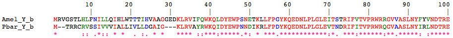
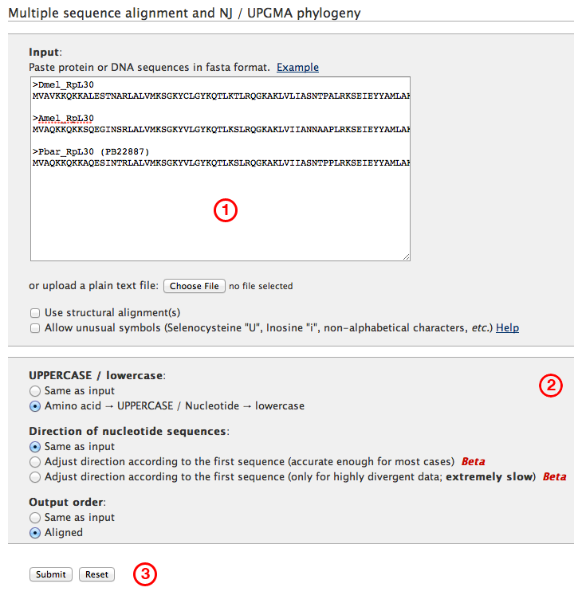
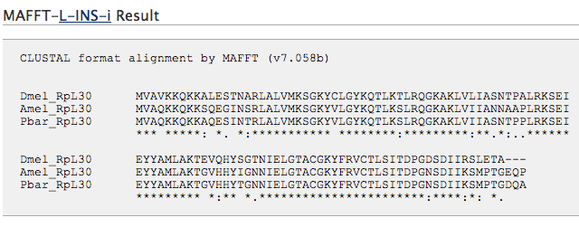
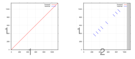

Many bioinformatic applications require an alignment between two or more biological sequences. Alignments reveal regions of similarity between sequences due to shared function, structure or evolutionary history. Typically, aligned sequences are represented as rows in a matrix, like in this example of two *yellow* genes from the honeybee *Apis mellifera* and the Red harvester ant *P. barbatus*:

&nbsp;

When arranged so that the most similar amino acid residues are found one below another in vertical columns, the strong similarity between the two genes becomes apparent (in addition, identical residues are highlighted in red, chemically similar ones in green and blue). In this case, the similarity is due to [homology][1]: both genes have evolved in the honeybee and the harvester ant from a single gene that was present in the last common ancestor of these two organisms. When aligned correctly, each position in an alignment is a statement of homology itself, being derived from the same position in the ancestral gene.

Because sequences do not only evolve by **substitution**, the change of one residue into another, but by the deletion or insertion of residues as well, gaps have to be introduced to properly align positions according to homology. Gaps are represented by a dash symbol (&#8220;–&#8221;) and also called **indels** because it is usually not possible to discern whether they indicate an insertion in one set of sequences, or a deletion in the other.

A variety of algorithms exist to calculate alignments, although describing them is beyond the scope of this tutorial (more information can be found [here][2]). Aligning multiple sequences is computationally difficult, and usually performed using heuristic approaches that are efficient but cannot guarantee to find the best match.

&nbsp;

#### MAFFT

MAFFT is a very accurate, versatile multiple alignment program. It is available as a [standalone application][3] suitable for scripting, or a [web version][4] that we will discuss here.

&nbsp;

(1). To align one or more sequences using MAFFT online, paste them into this input window in Fasta format. In this example, we are using protein sequences of the Cytoplasmic Ribosomal Protein gene RpL30 from three organisms.

(2). This section provides several input and output options. Note that you can adjust the direction of nucleotide sequences to conform to the first sequence, in case you are trying to align sequences derived from opposite DNA strands without having to reverse them first.

(3). Click &#8220;Submit&#8221; to run MAFFT

Below (see actual online version) you will find several advanced options. MAFFT includes different algorithms tailored to the number, divergence and gap structure of the sequences to be aligned. For most purposes, the auto option gives accurate results.

#### Results

Aligning the three genes above gives the following result in Clustal format. The alignment can also be displayed and downloaded in other formats, e.g. Fasta, which is easier to handle as input in downstream applications. MAFFT even provides the option to calculate a simple phylogenetic tree based on the alignment.

&nbsp;

#### Tips and further resources

— Algorithms that assume highly conserved regions interrupted by long gaps like MAFFT&#8217;s E-INS-i can be used to tentatively map transcripts to genomic sequence. While more specialized software like Exonerate or GeneWise should be used to identify the exact splice sites, the number and approximate position of exons can be discerned using this method. For instance, try to align [these two sequences][5] (transcript and genomic, respectively) using MAFFT.

— When aligning nucleotide sequences, MAFFT will only align forward strands (unless you use the input option &#8220;Adjust direction &#8230;&#8221; mentioned above), yet check for similarities on the reverse strands. The former are displayed in red, the latter in blue in plots like in the ones below. If there are blue lines, one or several of your input sequences might be in reverse. You can adjust the orientation using the &#8220;Refine dataset&#8221; button or the &#8220;make reverse complement sequence&#8221; option.

&nbsp;

— There are dozens of alternative alignment programs using different algorithms, examples for which are [ClustalW][6] (for pairwise, color-coded alignment like the one on the top of the page), [BLAST][7], Muscle, T-Coffee, prank, and PAL2NAL.

&nbsp;

Next chapter: [WebApollo][8]

&nbsp;

 [1]: ../41.homology-assessment
 [2]: http://en.wikipedia.org/wiki/Sequence_alignment#Multiple_sequence_alignment
 [3]: http://mafft.cbrc.jp/alignment/software/
 [4]: http://mafft.cbrc.jp/alignment/server/
 [5]: ../../wp-content/uploads/2013/08/Pbar_desat1_genomic.fas
 [6]: http://npsa-pbil.ibcp.fr/cgi-bin/npsa_automat.pl?page=/NPSA/npsa_clustalw.html
 [7]: http://blast.ncbi.nlm.nih.gov/Blast.cgi?PAGE_TYPE=BlastSearch&PROG_DEF=blastn&BLAST_PROG_DEF=megaBlast&SHOW_DEFAULTS=on&BLAST_SPEC=blast2seq&LINK_LOC=align2seq
 [8]: ../24.webapollo
