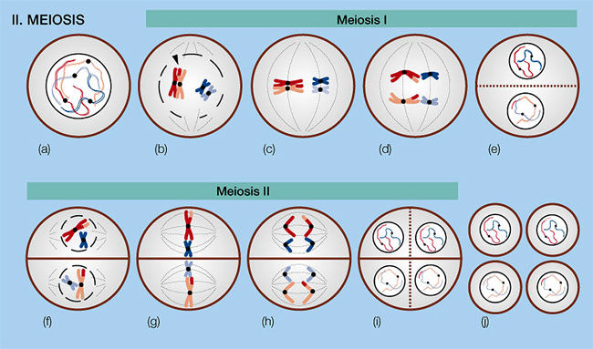



The following section will introduce groups or families of genes that lend themselves to gene annotation projects. They represent genes that pose interesting biological questions and are currently being studied in a range of insect genomes. You may pick one of these groups to contribute to these research efforts, or choose your own set of focal genes.

&nbsp;

#### Meiosis genes 

Organisms reproducing sexually rely on **meiosis**, a type of cell division producing gametes, sperm and egg cells. [Meiosis][1] promotes the recombination of genetic material inherited from the parents, and reduces the number of chromosomes by half so that upon fertilization of an cell by a sperm cell both halves are able to form a full set of chromosomes again. On the cellular level, meiosis is carefully orchestrated by the cytoskeleton and [spindle apparatus][2] to move the chromosomes, two structures that involve many genes to build and coordinate.

Some animals have forgone sexual reproduction and instead reproduce asexually by parthenogenesis, the development of an embryo from an unfertilized egg. However, this requires a mechanism to avoid the reduction of chromosomes, since in the absence of fertilization genetic material from the father is not available to bring the number of chromosomes back to a full set. It is likely that these changes are reflected in the transcription level and sequence of genes governing meiosis.

A good system to test this hypothesis is [*Wasmannia auropunctata*][3], a species of invasive ant in which queens of some populations are able to produce daughter queens parthenogenetically. Annotating genes involved in meiosis in *Wasmannia* is a prerequisite to look for sequence differences between populations with and without the ability of parthenogenesis. [Genes involved in meiosis in *D. melanogaster*][4] and the yeast [Saccharomyces cerevisiae][5] may serve as reference genes.

&nbsp;

#### Desaturases

This gene family encodes a group of enzymes involved in the production of alkenes by introducing double-bonds into alkanes. This function plays an important role in the lipid metabolism of animals, which on average possess about a dozen of different desaturases. They are also suspected of being involved in chemical communication in insects, because it has been shown that deactivating certain desaturases confounds species and sex recognition in fruit flies. The cuticle on the outside of most insects is covered by a waxy layer that prevents desiccation, but also contains many hydrocarbons that convey information about the identity of the individual. In social insects like ants, this information may even include the identity of the colony, and other information essential to living in a group.

Indeed, phylogenetic analyses have shown that desaturases have undergone a tumultuous history in insects, characterized by repeated episodes of gene gain and loss. This is especially true for Hymenoptera, the insect group comprising bees, wasps and ants. Some ant species contain two dozen desaturases, and just as many fragments of once functioning genes lost by mutation. The frequent gain and loss of desaturase genes might reflect changes in the chemical communication system of ants during their evolutionary history. Annotating these genes in other ant species with different social structures and needs to communicate might help to further illuminate this hypothesis.

The repertoire of desaturase genes in the Red harvester ant *P. barbatus* can be found [here][6], those of the fruit fly *D. melanogaster* [here][7].

&nbsp;

&nbsp;

#### Cytochrome P450s

&nbsp;

&nbsp;

#### Yellow/Major Royal Jelly Protein genes

&nbsp;

&nbsp;

#### Gustatory Receptors

&nbsp;

&nbsp;

#### 64 ant-specific genes

&nbsp;

&nbsp;

Next chapter: [Homology assessment][8]

&nbsp;

 [1]: http://en.wikipedia.org/wiki/Meiosis
 [2]: http://en.wikipedia.org/wiki/Spindle_apparatus
 [3]: ../14.ants
 [4]: ../../wp-content/uploads/2013/09/Dmel_Meiosis_aa.fas
 [5]: http://www.yeastgenome.org/cgi-bin/phenotype/phenotype.fpl?observable=meiotic%20recombination
 [6]: ../../wp-content/uploads/2013/08/Pbar_desats_pep.fas
 [7]: ../../wp-content/uploads/2013/08/Dmel_desats_pep.fas
 [8]: ../41.homology-assessment
