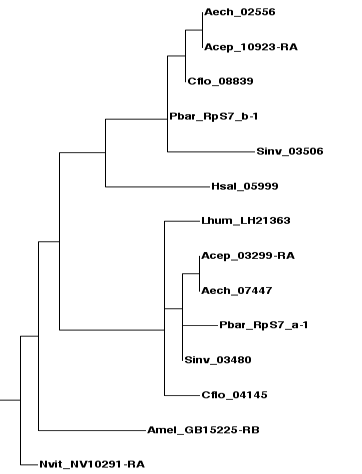



Homology is an important concept in evolutionary biology. Traits in two organisms are said to be homologous if they have evolved from the same trait in their last common ancestor. A well-known example are the forelimbs of mammals: the human arm is homologous to the wing of a bat, or the flipper of a dolphin, because the last common ancestor of humans, bats and dolphins (an extinct, prehistoric mammal), already had forelimbs from which all three directly evolved, even though their form and function have changed.

Homologous traits can be organs like in the example above, but may also be genes (or any pair of DNA sequences) defined by shared ancestry. However, in genetics, shared ancestry can be the result from two different processes, **speciation** and **gene duplication**. When a population splits into two lineages that later become separate species, both lineages initially possess the same set of genes. Each pair of genes that has thus evolved from the same gene in the last common ancestor are **orthologs**, or said to be orthologous to each other. On the other hand, two genes in an organism may also be derived from the same gene in the same lineage undergoing gene duplication, a common form of mutation generating new genetic material in all organisms. These genes are **paralogs**, or paralogous to each other. It is important to remember that both orthology and paralogy constitute a form of homology, and that a gene can be orthologous and paralogous to different genes at the same time.

&nbsp;

&nbsp;

Both concepts are illustrated by the gene trees above (a gene tree is a type of phylogenetic tree depicting the evolutionary history of genes through time). Initially, there is a single gene (black) in a single lineage, the last common ancestor of species 1 and 2.

In the scenario on the left **(1)**, this gene first undergoes a gene duplication event, and both copies (A and B in red and blue, respectively), while gradually evolving apart, persist in the last common ancestor until a subsequent speciation event splits the lineage into two new species. Both species inherit both copies of the duplicated gene, where they continue to diverge until the present day. Genes of different colors are paralogs because they are related through the initial gene duplication, regardless of whether they are found in the same (like 1A and 1B) or different species (like 1B and 2A). In contrast, genes sharing a color are more closely related through the speciation event and are therefore orthologs. By definition, orthologs can never be found in the same species.

The scenario on the right **(2)** shows what happens if the order of events is reversed: first, the ancestral lineage harboring the gene splits by speciation into two new species, both of which inherit the gene. Then independent gene duplication events create copies of the gene in each species. In this case, the genes found within each species are paralogous to each other. Between species, however, they are orthologous to *both* copies in the other species, because both are related through speciation first and then through gene duplication.

Whether two genes are orthologs or paralogs has important implications. In phylogenetics, they can be used to trace the relatedness of organisms because orthologous gene trees are a reflection of the species tree. Orthologous genes are also often assumed to fulfill similar or identical roles in two organisms. While this is not necessarily true, establishing orthology can often provide a first hint at the function of a newly discovered gene by comparing it to its orthologs from well-studied species.

&nbsp;

#### Identifying homologs

The most commonly used method to establish homology is through sequence similarity (sometimes, though not quite accurately, called sequence homology). In the absence of gene duplication events, it is reasonable to assume that orthologous genes fill an equivalent functional niche, and are more similar in sequence to each other than to any other gene. In a pairwise comparison, orthologs are therefore each other&#8217;s best match. This method, called the **reciprocal best hit method**, is easily implemented using [BLAST][1]. While all orthologs are reciprocal best BLAST hits, the reverse is not necessarily true: gene duplications and gene loss can lead to scenarios in which reciprocal best BLAST hits are actually paralogs. However, in simple cases, this method is very accurate and still useful to acquire a set of candidates genes for orthologs in more complex cases.

To see how it works, consider the following exercise:

  1. Starting with the [*D. melanogaster* Cytoplasmic Ribosomal Protein][2] RpL30, find the best match in *P. barbatus*, using the [BLAST tool on HGD&#8217;s Ant Portal][3] as described in the [chapter on BLAST searches][1] (blastp against the Official Gene Set).

  2. Take the best hit (PB22887; you can acquire the protein sequence by clicking on the gene identifier) and BLAST it against the annotated protein dataset of *D. melanogaster* on [FlyBase][4].

  3. Coming full circle, the best reciprocal hit turns out to be RpL30 (note that there are several alternative transcripts in the fly) — there seems to be only a single gene for RpL30 in both species, and they can be assumed to be orthologous to each other.

&nbsp;

In the example above, the lack of paralogs is evident by the fact that neither genome harbors another gene that comes even close in similarity. The following examples show what happens if there is. First, repeat the exercise above with Rp10Aa:

While *P. barbatus* provides only one single significant BLAST hit, PB25666, running the reciprocal BLAST search in *D. melanogaster* nets two genes, RpL10Aa and RpL10Ab. Moreover, the best reciprocal BLAST hit is RpL10Ab, not our starting gene RpL10Aa. This suggests that there are two paralogs in the fruit fly genome, and that RpL10Aa has diverged more from the ancestral gene than RpL10Ab. While it is possible that there were originally two copies in *P. barbatus* as well, one of which was subsequently lost, it is more parsimonious to assume that the fly paralogs came into being after the speciation event that split flies from ants. Both fly genes are therefore most likely orthologous to the *P. barbatus* gene.

The opposite case, a recent gene duplication leading to two paralogs in *P. barbatus*, both of which are orthologs to a single fly gene, is exemplified by RpLP0: There are two significant BLAST hits in *P. barbatus*, PB13254 and PB16486, both of which match the same gene in the fly.

&nbsp;

#### Tree-based homology assessment

Multiple instances of speciation and gene duplication in several species can create a complex web of homology relations that is impossible to resolve with the reciprocal best hit method, and requires the reconstruction of a **gene tree**. After all, orthology and paralogy are defined in phylogenetic terms. We will discuss phylogenetic reconstruction methods in the next chapter, but the following figure may illustrate the principle:

&nbsp;

 In this gene tree of RpS7 from select Hymenopteran species (bees, wasps and ants), some species are represented by a single gene, others by two genes (species can be distinguished by the four-letter prefixes of the gene identifiers). The duplicate genes fall into two groups, each forming a subtree with almost identical topology (or shape), which mostly reflects the known evolutionary relationships of the represented ant species (*Aech*, *Acep*, *Pbar*, *Sinv*, *Cflo*).

This pattern suggests that a gene duplication occurred in the lineage leading to the last common ancestor of these five species, all of which therefore inherited two copies. Since the gene in *Hsal* is more closely related to one set of genes, the duplication might be even older, and the *Hsal* copy belonging to the other set was since deleted from its genome.

Gene trees are useful to visualize the homology relations of a large number of genes, but are time-consuming to reconstruct and can be prone to artifacts in the tree reconstruction process. Phylogenies are not definite results of an infallible method, but hypotheses. For example, if the position of the *Hsal* gene in the gene tree is inaccurate, we would misinterpret the timing of the gene duplication event. Finally, to make sense of gene trees, the underlying species tree has to be known, which is not always the case.

#### Tips and further resources

— Sometimes, a BLAST search yields a short fragment with strong similarity to the query, on top of a full-length hit. Such fragments might be pseudogenes, remnants of a once functioning genes, and represent old paralogs. An example for this would be RpS4, which scores a second, albeit limited hit in *P. barbatus* (PB14930). Looking out for pseudogenes can give insight into the evolutionary history of a gene and help to resolve more difficult cases of homology.

— To group homologs across several genomes, both similarity-based clustering methods and phylogenetic approaches have been developed. Some of these gave rise to databases containing homology or **orthology groups** covering a wide range of species, including [OrthoDB][5], [Inparanoid][6], [HomoloGene][7] and [TreeFam][8].

— Further reading:

[Definition of homology][9] (Wikipedia)

[Sequence homology][10] (Wikipedia)

[Gene duplication][11] (Wikipedia)

[Review][12] on orthology and paralogy in the context of genomics

&nbsp;

Next chapter: Phylogenetics

&nbsp;

 [1]: ../22.blast
 [2]: ../../wp-content/uploads/2013/08/Dmel_CRPs.fas
 [3]: http://hymenopteragenome.org/ant_genomes/?q=blast
 [4]: http://flybase.org/blast/
 [5]: http://cegg.unige.ch/orthodb6
 [6]: http://inparanoid.sbc.su.se/cgi-bin/index.cgi
 [7]: http://www.ncbi.nlm.nih.gov/homologene
 [8]: http://www.treefam.org
 [9]: http://en.wikipedia.org/wiki/Homology_(biology)#Definition
 [10]: http://en.wikipedia.org/wiki/Homology_(biology)#Sequence_homology
 [11]: http://en.wikipedia.org/wiki/Gene_duplication
 [12]: ../../wp-content/uploads/2013/08/Koonin_2004.pdf
